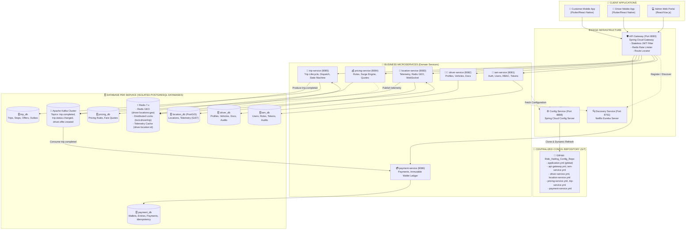
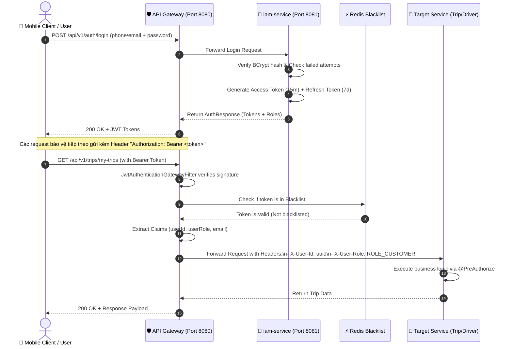
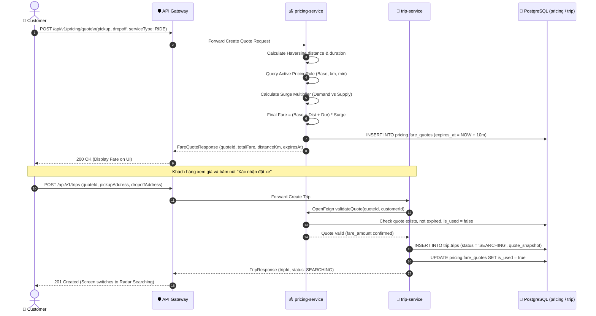
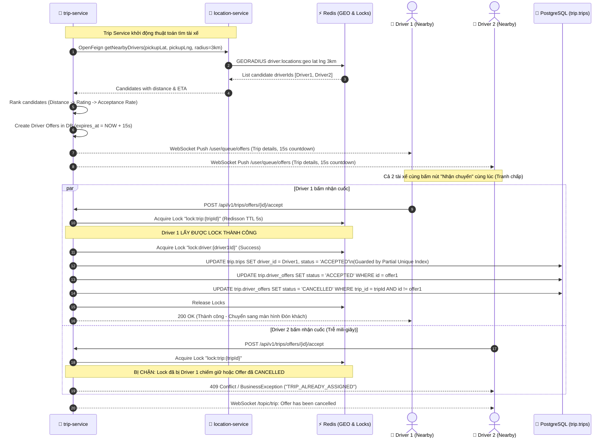
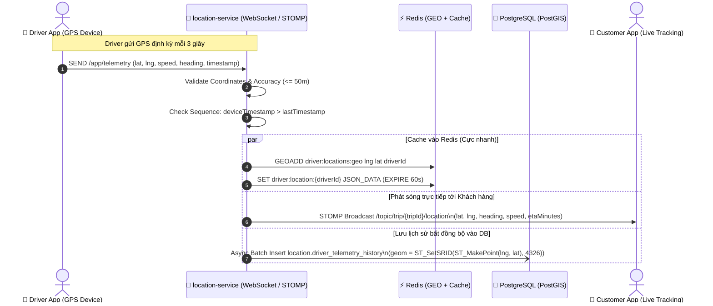
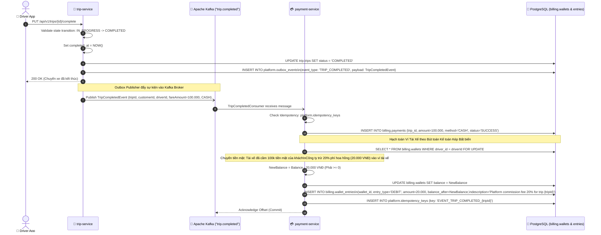
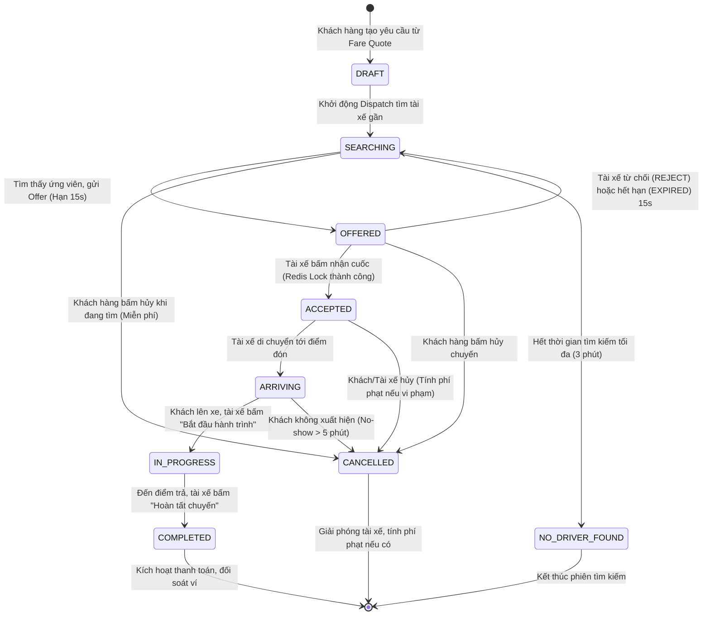

# TÀI LIỆU TOÀN DIỆN VỀ KIẾN TRÚC, CHỨC NĂNG & HỆ THỐNG SƠ ĐỒ (DIAGRAMS) DỰ ÁN RIDE-HAILING & LOGISTICS

> **Hệ thống đặt xe và giao hàng theo yêu cầu trong thời gian thực (Real-time Ride-Hailing & Logistics Platform)**  
> **Mã dự án:** `SRS-RHL-002`  
> **Kiến trúc:** Microservices Phân tán, Domain-Driven Design (DDD), Event-Driven Architecture (EDA)  
> **Ngôn ngữ & Nền tảng:** Java 21 LTS, Spring Boot 3.4.4, Spring Cloud 2024.0.1, PostgreSQL 18.3 + PostGIS 3.6.2, Redis 7.x, Apache Kafka 3.x, Docker  

---

## MỤC LỤC
1. [TỔNG QUAN HỆ THỐNG & TECH STACK](#1-tổng-quan-hệ-thống--tech-stack)
2. [KIẾN TRÚC TỔNG THỂ & SƠ ĐỒ THÀNH PHẦN (SYSTEM TOPOLOGY)](#2-kiến-trúc-tổng-thể--sơ-đồ-thành-phần-system-topology)
3. [MÔ HÌNH CƠ SỞ DỮ LIỆU POSTGRESQL & POSTGIS (ERD)](#3-mô-hình-cơ-sở-dữ-liệu-postgresql--postgis-erd)
4. [CÁC SƠ ĐỒ LUỒNG TUẦN TỰ NGHIỆP VỤ (SEQUENCE DIAGRAMS)](#4-các-sơ-đồ-luồng-tuần-tự-nghiệp-vụ-sequence-diagrams)
   - [4.1. Luồng Xác thực JWT & Phân quyền API Gateway](#41-luồng-xác-thực-jwt--phân-quyền-api-gateway)
   - [4.2. Luồng Báo giá (Fare Quote) & Đặt chuyến (Trip Booking)](#42-luồng-báo-giá-fare-quote--đặt-chuyến-trip-booking)
   - [4.3. Luồng Ghép xe & Khóa phân tán Nhận cuốc (Atomic Dispatch & Match)](#43-luồng-ghép-xe--khóa-phân-tán-nhận-cuốc-atomic-dispatch--match)
   - [4.4. Luồng Định vị Telemetry GPS & Phát sóng WebSocket Trực tiếp](#44-luồng-định-vị-telemetry-gps--phát-sóng-websocket-trực-tiếp)
   - [4.5. Luồng Hoàn tất chuyến, Thanh toán & Sổ cái Ví Bất biến](#45-luồng-hoàn-tất-chuyến-thanh-toán--sổ-cái-ví-bất-biến)
5. [MÔ HÌNH STATE MACHINE VÒNG ĐỜI CHUYẾN XE (STATE DIAGRAM)](#5-mô-hình-state-machine-vòng-đời-chuyến-xe-state-diagram)
6. [BÁCH KHOA TOÀN THƯ DANH MỤC CHỨC NĂNG & API REFERENCE (9 MICROSERVICES)](#6-bách-khoa-toàn-thư-danh-mục-chức-năng--api-reference-9-microservices)
7. [CÁC CƠ CHẾ KỸ THUẬT NÂNG CAO ĐẢM BẢO TÍNH TOÀN VẸN VÀ HIỆU NĂNG](#7-các-cơ-chế-kỹ-thuật-nâng-cao-đảm-bảo-tính-toàn-vẹn-và-hiệu-năng)

---

## 1. TỔNG QUAN HỆ THỐNG & TECH STACK

Dự án **Ride-Hailing & Logistics Platform** là hệ thống phân tán cấp độ doanh nghiệp (enterprise-grade) giải quyết bài toán điều phối xe và giao vận hàng hóa đa phương tiện theo thời gian thực với độ trễ thấp, tính chịu lỗi cao và an toàn tài chính tuyệt đối.

### Bảng tổng hợp Công nghệ cốt lõi:
| Thành phần | Công nghệ / Thư viện | Vai trò kỹ thuật |
|---|---|---|
| **Core Platform** | Java 21 LTS (Oracle OpenJDK) | Virtual Threads (Project Loom), Record Patterns, Pattern Matching |
| **Framework** | Spring Boot 3.4.4, Spring Cloud 2024.0.1 | Nền tảng Microservices, Dependency Injection, REST APIs |
| **API Gateway** | Spring Cloud Gateway (Netty Non-blocking) | Định tuyến, Stateless JWT Validation, Rate Limiting Token Bucket |
| **Service Discovery** | Netflix Eureka Server | Quản lý vòng đời dịch vụ, Service Registry, Client-side Load Balancing |
| **Config Center** | Spring Cloud Config Server | Quản lý cấu hình tập trung |
| **Inter-service Sync** | Spring Cloud OpenFeign + Resilience4j | Giao tiếp REST nội bộ, Circuit Breaker, Retry, Fallback an toàn |
| **Database** | PostgreSQL 18.3 + PostGIS 3.6.2 | 7 Schemas độc lập, GiST Spatial Indexing (EPSG:4326), Partial Unique Indexes |
| **Real-time Cache & Lock** | Redis 7.x (Jedis / Redisson) | Redis GEO (GEOADD, GEORADIUS), Distributed Locks (khóa tài xế/cuốc xe) |
| **Event Broker** | Apache Kafka 3.x | Xử lý sự kiện bất đồng bộ, Transactional Outbox, Pub/Sub |
| **Security** | Spring Security 6.x + JJWT 0.12.6 | Stateless JWT Access Token (15m), Refresh Token (7d), BCrypt (factor 12) |
| **Build & Quality** | Gradle 8.12, SonarQube, JUnit 5 | Quản lý phụ thuộc đa module, kiểm soát chất lượng mã nguồn 0 issue |

---

## 2. KIẾN TRÚC TỔNG THỂ & SƠ ĐỒ THÀNH PHẦN (SYSTEM TOPOLOGY)

Hệ thống tuân thủ nghiêm ngặt ranh giới Bounded Context của Domain-Driven Design (DDD). Mọi microservice sở hữu dữ liệu độc lập và chỉ tương tác qua API có hợp đồng hoặc Sự kiện Kafka.



---

## 3. MÔ HÌNH CƠ SỞ DỮ LIỆU POSTGRESQL & POSTGIS (DATABASE PER SERVICE - ERD)

Hệ thống áp dụng chuẩn mực **Database per Service Pattern**: 6 Cơ sở dữ liệu PostgreSQL độc lập tương ứng với 6 Domain Bounded Contexts, bảo đảm tính cô lập dữ liệu tuyệt đối giữa các miền nghiệp vụ.

```mermaid
erDiagram
    %% IAM SCHEMA
    USERS ||--o{ USER_ROLES : has
    ROLES ||--o{ USER_ROLES : assigns
    USERS ||--o{ REFRESH_TOKENS : owns
    USERS ||--o{ IAM_AUDIT_LOGS : tracks

    %% DRIVER SCHEMA
    DRIVER_PROFILES ||--o{ VEHICLES : operates
    DRIVER_PROFILES ||--o{ DRIVER_DOCUMENTS : uploads
    DRIVER_PROFILES ||--o{ DRIVER_AUDIT_LOGS : audits

    %% LOCATION SCHEMA
    DRIVER_LOCATIONS ||--o{ DRIVER_TELEMETRY_HISTORY : logs

    %% PRICING SCHEMA
    PRICING_RULES ||--o{ FARE_QUOTES : applies_to

    %% TRIP SCHEMA
    TRIPS ||--o{ TRIP_STOPS : contains
    TRIPS ||--o{ DRIVER_OFFERS : dispatches
    TRIPS ||--o{ TRIP_STATUS_HISTORY : transitions

    %% BILLING SCHEMA
    WALLETS ||--o{ WALLET_ENTRIES : records
    PAYMENTS ||--o{ REFUNDS : refunds

    %% PLATFORM SCHEMA
    PLATFORM_OUTBOX ||--o{ PLATFORM_IDEMPOTENCY : supports

    USERS {
        uuid id PK
        string phone_number UK
        string email UK
        string password_hash
        string full_name
        string status
        boolean is_verified
        timestamp created_at
    }

    ROLES {
        int id PK
        string role_name UK
    }

    USER_ROLES {
        uuid user_id PK,FK
        int role_id PK,FK
    }

    REFRESH_TOKENS {
        uuid id PK
        uuid user_id FK
        string token_hash UK
        timestamp expires_at
        boolean revoked
    }

    DRIVER_PROFILES {
        uuid id PK
        uuid user_id UK
        string license_number UK
        string national_id UK
        string status
        string availability_status
        numeric rating
        timestamp reviewed_at
    }

    VEHICLES {
        uuid id PK
        uuid driver_id FK
        string vehicle_type
        string license_plate UK
        string brand
        string model
        string status
    }

    DRIVER_DOCUMENTS {
        uuid id PK
        uuid driver_id FK
        string document_type
        string file_path
        string mime_type
        string status
    }

    DRIVER_LOCATIONS {
        uuid driver_id PK
        numeric latitude
        numeric longitude
        geometry geom
        numeric accuracy_meters
        numeric speed
        numeric heading
        timestamp updated_at
    }

    DRIVER_TELEMETRY_HISTORY {
        bigint id PK
        uuid driver_id FK
        geometry geom
        numeric speed
        timestamp recorded_at
    }

    PRICING_RULES {
        int id PK
        string service_type
        string city_code
        numeric base_fare
        numeric price_per_km
        numeric price_per_minute
        numeric peak_hour_multiplier
        boolean is_active
    }

    FARE_QUOTES {
        uuid id PK
        uuid customer_id
        string service_type
        numeric distance_km
        numeric estimated_duration
        numeric surge_multiplier
        numeric total_fare
        timestamp expires_at
        boolean is_used
    }

    TRIPS {
        uuid id PK
        uuid customer_id
        uuid driver_id
        uuid quote_id
        string service_type
        string status
        numeric fare_amount
        string pickup_address
        string dropoff_address
        timestamp accepted_at
        timestamp completed_at
        timestamp created_at
    }

    TRIP_STOPS {
        uuid id PK
        uuid trip_id FK
        int stop_sequence
        string address
        numeric latitude
        numeric longitude
        string status
    }

    DRIVER_OFFERS {
        uuid id PK
        uuid trip_id FK
        uuid driver_id
        string status
        int sequence_number
        timestamp expires_at
        timestamp created_at
    }

    TRIP_STATUS_HISTORY {
        bigint id PK
        uuid trip_id FK
        string from_status
        string to_status
        uuid actor_id
        string actor_role
        string reason
        timestamp created_at
    }

    WALLETS {
        uuid id PK
        uuid driver_id UK
        numeric balance
        string currency
        boolean is_locked
        timestamp updated_at
    }

    WALLET_ENTRIES {
        uuid id PK
        uuid wallet_id FK
        string entry_type
        numeric amount
        numeric balance_after
        string reference_id
        string description
        timestamp created_at
    }

    PAYMENTS {
        uuid id PK
        uuid trip_id UK
        uuid customer_id
        string payment_method
        numeric amount
        string status
        string transaction_reference
        timestamp created_at
    }

    REFUNDS {
        uuid id PK
        uuid payment_id FK
        uuid trip_id
        numeric amount
        string status
        string refund_reason
        timestamp created_at
    }
```



---

## 4. CÁC SƠ ĐỒ LUỒNG TUẦN TỰ NGHIỆP VỤ (SEQUENCE DIAGRAMS)

### 4.1. Luồng Xác thực JWT & Phân quyền API Gateway
Mô tả quy trình đăng nhập, nhận JWT Token và cách API Gateway bảo vệ các REST endpoint nghiệp vụ bằng cơ chế Stateless Claims Injection.



---

### 4.2. Luồng Báo giá (Fare Quote) & Đặt chuyến (Trip Booking)
Mô tả việc tính toán cước động (Surge Pricing Engine) có thời hạn 10 phút và lưu snapshot vào bản ghi Chuyến xe.



---

### 4.3. Luồng Ghép xe & Khóa phân tán Nhận cuốc (Atomic Dispatch & Match)
Giải quyết triệt để vấn đề Race Condition và gán xe trùng lặp (BR-002, BR-003, CON-06, NFR-REL-003) thông qua **Redis Distributed Lock** và **Partial Unique Index**.



---

### 4.4. Luồng Định vị Telemetry GPS & Phát sóng WebSocket Trực tiếp
Đảm bảo độ trễ truyền tọa độ < 1.0 giây từ tài xế đến khách hàng đang theo dõi (NFR-PERF-001, FR-RT-002, FR-RT-003).



---

### 4.5. Luồng Hoàn tất chuyến, Thanh toán & Sổ cái Ví Bất biến
Triển khai mẫu hình **Transactional Outbox**, phát sự kiện qua **Apache Kafka**, và hạch toán ví tài xế theo mô hình **Kế toán kép Bất biến (Immutable Financial Ledger)** (BR-011, BR-012, FR-WAL-002).



---

## 5. MÔ HÌNH STATE MACHINE VÒNG ĐỜI CHUYẾN XE (STATE DIAGRAM)

Mọi thao tác thay đổi trạng thái cuốc xe bắt buộc phải tuân theo sơ đồ chuyển đổi trạng thái (State Transition Model). Bất kỳ lệnh chuyển trạng thái nào nằm ngoài luồng định nghĩa đều lập tức bị từ chối bằng `BusinessException("INVALID_STATE_TRANSITION")`.



---

## 6. BÁCH KHOA TOÀN THƯ DANH MỤC CHỨC NĂNG & API REFERENCE (9 MICROSERVICES)

Dưới đây là bảng phân rã chi tiết toàn bộ các module và REST API Endpoints trong hệ sinh thái của dự án:

### 6.1. Module `api-gateway` (Port 8080)
- **Chức năng:** Điểm truy cập duy nhất (Single Point of Entry), định tuyến ngược (Reverse Proxy), xác thực Stateless JWT, lọc CORS, Rate Limiting Token Bucket.
- **Thành phần:** `JwtAuthenticationGatewayFilter`, `GatewayConfig`.
- **Cơ chế định tuyến:**
  - `/api/v1/auth/**` & `/api/v1/users/**` -> `lb://iam-service`
  - `/api/v1/drivers/**` & `/api/v1/vehicles/**` -> `lb://driver-service`
  - `/api/v1/locations/**` & `/ws/**` -> `lb://location-service`
  - `/api/v1/pricing/**` -> `lb://pricing-service`
  - `/api/v1/trips/**` -> `lb://trip-service`
  - `/api/v1/payments/**` & `/api/v1/wallets/**` -> `lb://payment-service`

### 6.2. Module `iam-service` (Port 8081)
- **Chức năng:** Định danh, quản lý tài khoản người dùng, phân quyền vai trò (RBAC), cấp phát và thu hồi JWT tokens.
- **Danh mục API:**
  | Method | Endpoint | Quyền (Role) | Mô tả chức năng |
  |---|---|---|---|
  | `POST` | `/api/v1/auth/register` | Public | Đăng ký tài khoản Khách hàng / Tài xế |
  | `POST` | `/api/v1/auth/login` | Public | Đăng nhập hệ thống, cấp Access Token & Refresh Token |
  | `POST` | `/api/v1/auth/refresh-token` | Public | Cấp lại Access Token mới từ Refresh Token |
  | `POST` | `/api/v1/auth/logout` | Authenticated | Đăng xuất, thu hồi Refresh Token vào danh sách hủy |
  | `GET` | `/api/v1/users/profile` | Authenticated | Xem thông tin hồ sơ người dùng đang đăng nhập |
  | `PUT` | `/api/v1/users/profile` | Authenticated | Cập nhật tên, ảnh đại diện, email liên hệ |
  | `PUT` | `/api/v1/admin/users/{id}/status` | `ROLE_ADMIN` | Khóa hoặc mở khóa tài khoản người dùng |

### 6.3. Module `driver-service` (Port 8082)
- **Chức năng:** Quản lý vòng đời hồ sơ tài xế (DRAFT -> APPROVED), thông tin phương tiện, tải lên giấy tờ (CCCD, GPLX), trạng thái khả dụng (AVAILABLE, BUSY, OFFLINE).
- **Danh mục API:**
  | Method | Endpoint | Quyền (Role) | Mô tả chức năng |
  |---|---|---|---|
  | `POST` | `/api/v1/drivers/profile` | `ROLE_DRIVER` | Tạo hồ sơ tài xế (bằng lái, CCCD) |
  | `GET` | `/api/v1/drivers/profile/me` | `ROLE_DRIVER` | Xem thông tin hồ sơ tài xế hiện tại |
  | `POST` | `/api/v1/drivers/vehicles` | `ROLE_DRIVER` | Đăng ký phương tiện (biển số, loại xe) |
  | `PUT` | `/api/v1/drivers/availability` | `ROLE_DRIVER` | Chuyển trạng thái hoạt động (ONLINE / OFFLINE) |
  | `POST` | `/api/v1/drivers/documents/upload` | `ROLE_DRIVER` | Upload ảnh GPLX, CCCD, đăng kiểm xe |
  | `GET` | `/api/v1/admin/drivers/pending` | `ROLE_ADMIN` | Xem danh sách tài xế đang chờ duyệt |
  | `PUT` | `/api/v1/admin/drivers/{id}/approve` | `ROLE_ADMIN` | Phê duyệt hồ sơ tài xế hoạt động |
  | `PUT` | `/api/v1/admin/drivers/{id}/reject` | `ROLE_ADMIN` | Từ chối hồ sơ tài xế kèm lý do chi tiết |

### 6.4. Module `location-service` (Port 8083)
- **Chức năng:** Tiếp nhận tọa độ telemetry GPS, định vị không gian Redis GEO, đồng bộ PostGIS, tìm tài xế gần điểm đón, WebSocket live broadcast.
- **Danh mục API:**
  | Method | Endpoint | Quyền (Role) | Mô tả chức năng |
  |---|---|---|---|
  | `POST` | `/api/v1/locations/telemetry` | `ROLE_DRIVER` | Cập nhật vị trí GPS tài xế (lat, lng, speed, heading) |
  | `GET` | `/api/v1/locations/nearby` | Authenticated | Quét tìm tài xế khả dụng xung quanh tọa độ (bán kính R) |
  | `GET` | `/api/v1/locations/driver/{id}` | Authenticated | Lấy tọa độ tức thời mới nhất của tài xế |
  | `GET` | `/api/v1/admin/locations/active` | `ROLE_ADMIN` | Lấy tọa độ toàn bộ tài xế đang online phục vụ bản đồ nhiệt |
  | `WS` | `/ws/telemetry` | Authenticated | Kênh WebSocket STOMP truyền tọa độ thời gian thực |

### 6.5. Module `pricing-service` (Port 8084)
- **Chức năng:** Động cơ định giá cước chuyến (Surge Engine), tính giá cơ sở, khoảng cách, thời gian, phụ phí đêm/cao điểm, sinh Fare Quote 10 phút.
- **Danh mục API:**
  | Method | Endpoint | Quyền (Role) | Mô tả chức năng |
  |---|---|---|---|
  | `POST` | `/api/v1/pricing/quote` | `ROLE_CUSTOMER` | Tạo báo giá cước trước khi đặt xe (hiệu lực 10 phút) |
  | `GET` | `/api/v1/pricing/quote/{id}` | Authenticated | Tra cứu chi tiết báo giá và hạn hiệu lực |
  | `GET` | `/api/v1/admin/pricing/rules` | `ROLE_ADMIN` | Xem danh sách các bảng giá hiện hành |
  | `PUT` | `/api/v1/admin/pricing/rules/{id}` | `ROLE_ADMIN` | Cập nhật giá mở cửa, giá/km, hệ số giờ cao điểm |

### 6.6. Module `trip-service` (Port 8085)
- **Chức năng:** Quản lý vòng đời chuyến xe, thuật toán Dispatch, khóa phân tán nhận cuốc xe nguyên tử, hủy chuyến, phát sự kiện Kafka `trip.completed`.
- **Danh mục API:**
  | Method | Endpoint | Quyền (Role) | Mô tả chức năng |
  |---|---|---|---|
  | `POST` | `/api/v1/trips` | `ROLE_CUSTOMER` | Đặt chuyến xe mới từ Fare Quote hợp lệ |
  | `GET` | `/api/v1/trips/{id}` | Authenticated | Xem chi tiết thông tin và lộ trình chuyến xe |
  | `POST` | `/api/v1/trips/offers/{id}/accept` | `ROLE_DRIVER` | Tài xế bấm chấp nhận offer nhận chuyến (Redis Lock) |
  | `POST` | `/api/v1/trips/offers/{id}/reject` | `ROLE_DRIVER` | Tài xế từ chối offer chuyến xe |
  | `PUT` | `/api/v1/trips/{id}/arriving` | `ROLE_DRIVER` | Tài xế báo đã đến điểm đón khách |
  | `PUT` | `/api/v1/trips/{id}/start` | `ROLE_DRIVER` | Khách lên xe, tài xế bắt đầu chuyến đi |
  | `PUT` | `/api/v1/trips/{id}/complete` | `ROLE_DRIVER` | Hoàn thành chuyến xe, kích hoạt thanh toán |
  | `POST` | `/api/v1/trips/{id}/cancel` | Authenticated | Khách hàng hoặc tài xế hủy chuyến xe kèm lý do |
  | `GET` | `/api/v1/trips/my-trips` | Authenticated | Lịch sử các chuyến xe cá nhân có phân trang |

### 6.7. Module `payment-service` (Port 8086)
- **Chức năng:** Quản lý thanh toán tiền mặt/ví, tiêu thụ sự kiện Kafka `trip.completed`, Sổ cái tài chính Ví tài xế Bất biến (Immutable Ledger), hoàn tiền.
- **Danh mục API:**
  | Method | Endpoint | Quyền (Role) | Mô tả chức năng |
  |---|---|---|---|
  | `POST` | `/api/v1/payments/confirm-cash` | `ROLE_DRIVER` | Xác nhận đã thu tiền mặt từ khách hàng |
  | `GET` | `/api/v1/wallets/me` | `ROLE_DRIVER` | Xem số dư ví tài xế hiện tại |
  | `GET` | `/api/v1/wallets/statement` | `ROLE_DRIVER` | Xem sao kê biến động số dư ví (Wallet Entries) |
  | `POST` | `/api/v1/wallets/topup` | `ROLE_DRIVER` | Nạp tiền vào ví tài xế qua cổng thanh toán |
  | `POST` | `/api/v1/wallets/withdraw` | `ROLE_DRIVER` | Yêu cầu rút tiền từ ví về tài khoản ngân hàng |
  | `POST` | `/api/v1/payments/refund` | `ROLE_ADMIN` | Thực hiện hoàn tiền cho khách theo khiếu nại |

### 6.8. Module `discovery-service` (Port 8761) & `config-service` (Port 8888)
- **Eureka Server:** Quản lý danh bạ IP/Port của toàn bộ instances microservices, hỗ trợ tự phục hồi và tự động hủy đăng ký khi instance chết.
- **Config Server:** Lưu trữ tập trung các tệp `.yml` cấu hình môi trường, hỗ trợ nạp cấu hình nóng mà không cần build lại mã nguồn.

### 6.9. Module `common-library`
- Thư viện chia sẻ chung giữa các microservices chứa:
  - `SecurityConstants`, `JwtUtil`, `UserPrincipal`: Cấu hình an ninh bảo mật.
  - `ApiResponse<T>`, `PageResponse<T>`, `ErrorResponse`: Chuẩn định dạng phản hồi API.
  - `GlobalExceptionHandler`: Xử lý ngoại lệ toàn cục chuẩn RFC 7807 ProblemDetail.
  - `TripCompletedEvent`, `DriverLocationUpdatedEvent`: Schema sự kiện Kafka.

---

## 7. CÁC CƠ CHẾ KỸ THUẬT NÂNG CAO ĐẢM BẢO TÍNH TOÀN VẸN VÀ HIỆU NĂNG

### 7.1. Chống Race Condition bằng Redis Distributed Lock & Partial Unique Index
- **Nguy cơ:** Trong môi trường phân tán với hàng ngàn tài xế, hai tài xế cùng bấm nhận 1 cuốc trong cùng 1 mili-giây có thể khiến chuyến bị gán trùng lặp, gây xung đột nghiêm trọng.
- **Giải pháp 2 tầng phòng thủ:**
  1. *Tầng ứng dụng (Redis Redisson Lock):* Khóa key `lock:trip:{tripId}` và `lock:driver:{driverId}` với TTL 5s. Chỉ request đầu tiên giành được khóa mới được đi tiếp.
  2. *Tầng cơ sở dữ liệu (PostgreSQL Partial Unique Index):* Ràng buộc duy nhất có điều kiện:
     ```sql
     CREATE UNIQUE INDEX idx_trips_driver_active_unique 
     ON trip.trips (driver_id) 
     WHERE status IN ('ACCEPTED', 'ARRIVING', 'IN_PROGRESS');
     ```
     Dù lỗi logic ở tầng code xảy ra, tầng database vẫn ném lỗi `DataIntegrityViolationException`, đảm bảo 1 tài xế **không bao giờ** có 2 cuốc xe đang chạy đồng thời.

### 7.2. Transactional Outbox Pattern cho Sự Kiện Kafka
- **Nguy cơ:** Khi hoàn thành chuyến xe, nếu update database thành công nhưng mạng Kafka bị gián đoạn, sự kiện không được gửi đi, dẫn tới tài xế bị mất tiền chuyến xe (Dual-Write Problem).
- **Giải pháp:** Lưu bản ghi sự kiện vào bảng `platform.outbox_events` trong cùng một Local Transaction với lệnh cập nhật `trip.trips`. Một Outbox Worker chạy ngầm quét bảng này và đẩy vào Kafka với cơ chế At-least-once Delivery, loại bỏ hoàn toàn nguy cơ mất dữ liệu tài chính.

### 7.3. Sổ Cái Tài Chính Bất Biến (Immutable Financial Ledger)
- **Nguy cơ:** Lệnh `UPDATE wallets SET balance = balance + 10000` trực tiếp vào database không để lại dấu vết kiểm toán, dễ bị hacker can thiệp hoặc sai lệch khi đối soát kế toán.
- **Giải pháp:** Mọi biến động số dư **bắt buộc** phải sinh ra một bản ghi trong bảng `billing.wallet_entries` (`CREDIT` hoặc `DEBIT`) kèm tham chiếu mã giao dịch `reference_id` và số dư sau giao dịch `balance_after`. Tuyệt đối không cho phép lệnh sửa hay xóa trong bảng này (Append-only).

### 7.4. Bảo Vệ Tọa Độ Nhạy Cảm & Quyền Riêng Tư (PII)
- Vị trí thời gian thực của tài xế chỉ được broadcast cho đúng khách hàng của chuyến xe đó thông qua kênh riêng biệt `trip:{tripId}:location` và chỉ mở trong thời gian cuốc xe đang diễn ra. Khi cuốc xe COMPLETED hoặc CANCELLED, kênh chia sẻ vị trí lập tức bị hủy.
- Số điện thoại người dùng hiển thị trên ứng dụng của bên kia luôn được che bớt (Masking: `090****567`).

---

## TỔNG KẾT

Tài liệu này cung cấp toàn cảnh kiến trúc kỹ thuật chuẩn chỉnh của dự án **Ride-Hailing & Logistics Platform**, từ ranh giới thiết kế miền, cấu trúc cơ sở dữ liệu phân tán đến từng luồng nghiệp vụ chi tiết và giải pháp phòng thủ lỗi. Hệ thống đã được triển khai hoàn chỉnh, biên dịch thành công 100%, kiểm thử vượt qua toàn bộ test cases và sẵn sàng phục vụ kiểm thử thực tế cũng như triển khai hạ tầng đám mây.
